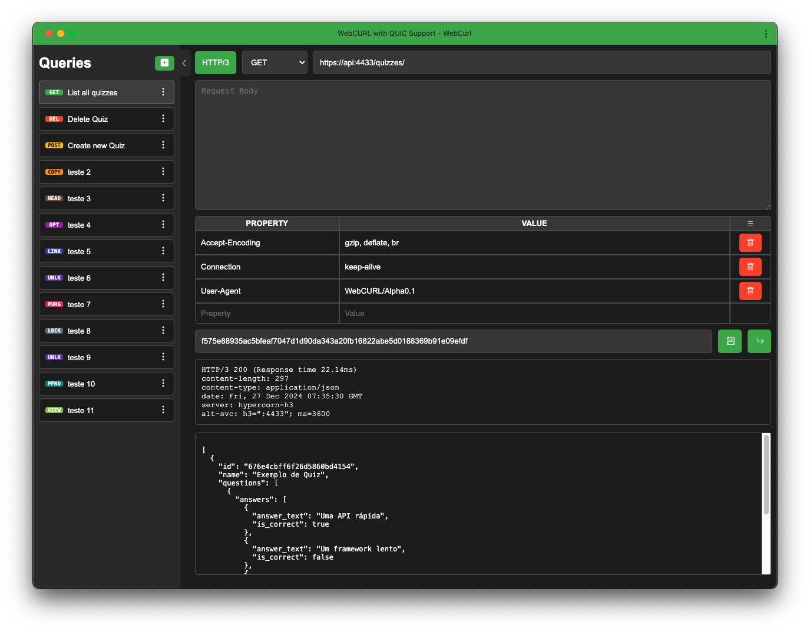

# 🎮 OpenQUIZ Game
Create your own QUIZ server game with a simple management API. This project is in an early stage and can be an Open Source alternative to other QUIZ team games like Kahoot. This is a new version refactored to simplify the structure of Rest API, Routes and endpoints and many more other simplified schemes to speedup, and make this API 100% compliance with OpenAPI Specifications.

In time...I change from old loved Flask RestAPI, to FastAPI + Hypercorn framework and support to HTTP/3 and QUIC with Python aioquic library. FastAPI is a framework with high performance, easy to learn, fast to code, ready for production 🚀

## 🖨️ Technologies
- [x] 🖥️ Containers ( podman, docker, rancher desktop and others)
- [x] 💾 MongoDB ( Data Persist )
- [x] 🐍 Python w/ FastAPI ( Support to HTTP/3 and QUIC )
- [X] 📃 SwaggerUI for API Documentation
- [x] 🌐 HTML 3.0 and CSS ( Frontend )
- [ ] 🧪 Maybe... RabbitMQ ( Queue )

## 🪒 In development
- [x] API Test tool with QUIC Support ( See WebCURL )
- [ ] Frontend for Admin
- [ ] Frontend for Logged Players
  - Player Profile
    - Preferred Themes
    - About Me
    - Social Media Share
  - Game Community
    - Friend List
    - Random QUIZZES
  - Scoreboard for played QUIZZES
  - Random Create Trivias
- [ ] Frontend for Ephemeral Players
- [ ] OAUTH / SSO Login with Google

## 🛠️ Setup Instructions
You need to select MongoDB version in .env ( instructions inside than )... MongoDB 5.0 needs a CPU with AVX support, and with some old processors like XEON X5680 ( my fully functional old macpro 5,1 for example ), cannot be run it. Then I made 2 versions of compose. Build the stack and be happy 🎉

**Docker** can be changed by any orchestrator with compose support like docker, podman and rancher desktop. Choose your, and change it in the command. My recommendation is PODMAN, fast, security, don't need root/admin to run, and other little good features, see it here [PODMAN](https://podman.io/).

```bash
$ docker compose up -d --build
or
$ podman compose up -d --build
```

>[!IMPORTANT]
> Rename **.env-example** and **docker-compose.yml-example** removing '**-example**' and adjust your parameters according your system, like passwords, authkeys, Bearrier Token, version of Mongo DB, sensible data and others; into helpers, the script gentoken.sh is an automatic bearier token generator, use ir from root diretory with command **helpers/gentoken.sh**.


## 🧪 How can I test?
>[!NOTE]
>At this time no one update yours API Test tools ( like postman or insomnia ), to support HTTP/3 or QUIC. Then... use everything UI you want, I preffer Postman, and put into root of this repo, a Postman Collection with all you need. "And All You need is ❤️ " - Lennon. John 🪲

>[!TIP]
>But... Don't worry! See WebCURL at http://localhost:8001.

>[!IMPORTANT]
>Above, endpoint, routes and payloads to test OpenQUIZ API Rest.

## ➰ About WebCURL with QUIC support
WebCURL container into stack, is my own API Test tool, create with Python, HTML, CSS and Javascript, at this time is 100% functional. You can change docker-compose.yml ( instruction inside ), to use it for any purpose with any kind of API's ( but without QUIC/HTTP3 ) or inside OpenQUIZ stack with full QUIC/HTTP3 support, but you need to use URL https://api:4433/quizzes/. Is fast! really fast... and you can install it with Google Chrome, and use offline like an application ( PWA Model ); Browser access at http://localhost:8001, soon as possible I fork it into a full project.

Look this simple and beatiful screen above! ❤️



## 📃  API Documentation ( SwaggerUI, Redoc and Schemas )
All requisition use the same request Header, and the same bearrier token ( see into .env if you generate it ). To see SwaggerUI, Redoc or JSON Schemas... open any browser and access this addresses:
```html
Swagger - https://{server}:4433/docs
Redoc   - https://{server}:4433/redoc
```

**Request Headers**
```JSOn
[
    {"Content-Type": "application/json"},
    {"Accept-Encoding":"gzip, deflate, br"},
    {"Connection": "keep-alive"}
]
```

## 🎲 Create a Quiz
**Method and endpoint**
```
Method  : { POST }
Endpoint: https://{server}/quizzes/
```

**Request body**
```json
{
    "name": "Quiz Example",
    "questions": [
        {
            "question_text": "What is FastAPI?",
            "points": 100,
            "answers": [
                {
                    "answer_text": "The ONE! Fastest API Rest Framework",
                    "is_correct": true
                },
                {
                    "answer_text": "An generic API Rest Framework",
                    "is_correct": false
                }
            ]
        }
    ]
}
```

## 🔎 List Quizzes
**Method and endpoint**
```txt
Method  : { GET }
Endpoint: https://{server}/quizzes/
```

## ✂️ Update a Quiz
**Method and endpoint**
```txt
Method  : { PUT }
Endpoint: https://{server}/quizzes/{id}
```
**Request Body**
```json
{
    "name": "Quiz Example",
    "questions": [
        {
            "question_text": "FastAPI or Flask RestAPI?",
            "points": 100,
            "answers": [
                {
                    "answer_text": "Both are an good choice!",
                    "is_correct": false
                },
                {
                    "answer_text": "But... FastAPI is FAST!",
                    "is_correct": true
                }
            ]
        }
    ]
}
  ```

## 🧨 Delete a Quiz
**Method and endpoint**
```txt
Method  : { DEL }
Endpoint: https://{server}/quizzes/{id}
```

## ➕ Create a User
**Method and endpoint**
```txt
Method  : { POST }
Endpoint: https://{server}/users/
```

**Request body**
```json
{
    "email": "user@example.com",
    "first_name": "Nome",
    "last_name": "Sobrenome",
    "password": "min8chars"
}
```

## 🔎 List Users
**Method and endpoint**
```txt
Method  : { GET }
Endpoint: https://{server}/users/
```

**Query params**
- `email`: filter by email (optional)
- `page`: page number (optional)

## ♻️ Update a User
**Method and endpoint**
```txt
Method  : { PUT }
Endpoint: https://{server}/users/
```

**Request body**
```json
{
    "email": "user@example.com",
    "first_name": "NovoNome",
    "last_name": "NovoSobrenome",
    "password": "outrasenha"
}
```
